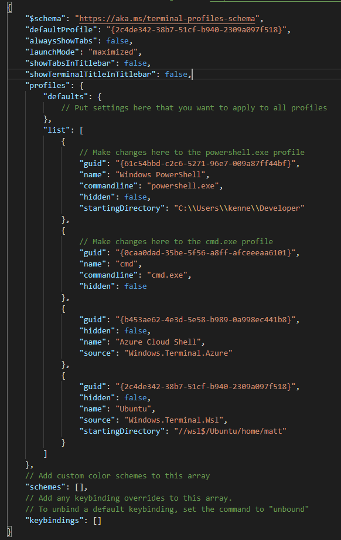

# Configuration
**Note: if you are not me make sure to change the name and email in the gitconfig!**

## Initial Setup

### WSL2

Open powershell as administrator and run ([source](https://docs.microsoft.com/en-us/windows/wsl/install-win10)):
```powershell
dism.exe /online /enable-feature /featurename:Microsoft-Windows-Subsystem-Linux /all /norestart
dism.exe /online /enable-feature /featurename:VirtualMachinePlatform /all /norestart
```
Restart the computer.
```powershell
wsl --set-default-version 2
```

[Go to the windows store](https://aka.ms/wslstore) and install Ubuntu.

Launch Ubuntu and follow the installation instructions. Once complete run the following commands:

```shell
sudo apt-get update
sudo apt-get upgrade
sudo apt install build-essential
```

The build essential package includes utilities needed for future installations.

### Windows Terminal
[Go to the microsoft store](https://aka.ms/windowsterminal) and install the windows terminal


#### Change the default profile to WSL2
After installing the windows terminal the default profile will probably be powershell. We want the default profile to be our WSL profile.

1. Open the config json settings by pressing ctrl+, in the windows terminal.
2. Scroll down until you find the profile with the name Ubuntu (or whatever linux distro you are using).
3. Copy the guid.
4. Scroll back up and replace the defaultProfile value to be the guid you just copied.

#### Change the starting directory in WSL
When using WSL2 it is [more performant to store files in the linux file system](https://docs.microsoft.com/en-us/windows/wsl/compare-versions). Therefore, it is best to set the starting directory at launch to be the linux home directory.  

1. Open the config json settings by pressing ctrl+, in the windows terminal.
2. Scroll down until you find the profile with the name Ubuntu (or whatever linux distro you are using).
3. Add a new field "startingDirectory" to the profile with the value "//wsl$/<linux distro>/home/<linux username>". For example, mine is "//wsl$/Ubuntu/home/matt".

#### Other settings
I do not make use of the tabs provided by the windows terminal. I find tmux much better. As a result I change some settings to get rid of the tabs. I also like to make sure the terminal is maximised on launch and not have the terminal title displayed in the title bar.

Add the following settings below defaultProfile:
1. "alwaysShowTabs": false
2. "showTabsInTitleBar": false
3. "launchMode": "maximized"
4. "showTerminalTitleInTitleBar": false

If using vim the default keybindings will override some of the vim keybindings, therefore it is a good idea to remove all of the keybings set by default from the array.



See here for further details.

### Fish
Execute the following commads to change the dafult shell to fish:

```shell
sudo apt-add-repository ppa:fish-shell/release-3
sudo apt-get update
sudo apt-get install fish
chsh -s /usr/bin/fish
```

Restart the terminal and fish should be launched.

[See the repo for further details.](https://github.com/fish-shell/fish-shell)

### Adding configuration files
If using bash then a $ needs to be added before the ().
```shell
git clone https://github.com/kennedymj97/configs.git
cd configs
ln -s (pwd)/nvim/ ~/.config/
ln -s (pwd)/tmux/ ~/.config/
ln -s ~/.config/tmux/tmux.conf ~/.tmux.conf
rm ~/.gitconfig
ln -s (pwd)/gitconfig ~/.gitconfig
rm ~/.config/fish/config.fish
ln -s (pwd)/config.fish ~/.config/fish/config.fish
```
On compeltion restart the terminal.

### Neovim
If you try to install neovim through the package manager an old version is installed which is not compatible with some of the plugins. To install an up to date version of neovim ([source](https://github.com/neovim/neovim/wiki/Installing-Neovim):

```shell
curl -LO https://github.com/neovim/neovim/releases/download/stable/nvim.appimage
chmod +x nvim.appimage
sudo mv ./nvim.appimage /usr/bin/nvim
```

#### Vim Plugged
I like to use vim plugged to manage my plugins for vim. Installation instruction follow ([source](https://github.com/neovim/neovim/wiki/Installing-Neovim)):
```shell
curl -fLo ~/.local/share/nvim/site/autoload/plug.vim --create-dirs https://raw.githubusercontent.com/junegunn/vim-plug/master/plug.vim
mkdir ~/.local/share/nvim/site/plugged
```

#### Installing the plugins
Install the plugins by launching nvim and typing :PlugInstall.

##### Node.js
My vim setup makes use of [coc.nvim](https://github.com/neoclide/coc.nvim). To use this node.js has to be installed.

1. Go to the [node website](https://www.nodejs.org/en/) and check the latest stable version.
2. Go to the [nodesource repo](https://github.com/nodesource/distributions#deb) and follow instructions to install the latest version.

#### Fuzzy finder (fzf)
I mostly use [fzf](https://github.com/neoclide/coc.nvim) to open files and move between buffers in vim but it can also be used in the shell to quickly change directories.  

```shell
git clone --depth 1 https://github.com/junegunn/fzf.git ~/.fzf
~/.fzf/install
```

I also use [ripgrep](https://github.com/BurntSushi/ripgrep) to enable searching for files based on the contents rather than the filename. It requires rust to be installed. To install rust:

1. Go to the [install page](https://www.rust-lang.org/tools/install) on the rust site and follow the instructions.

Once rust is installed ripgrep can then be installed:

```shell
cargo install ripgrep
```

### Styling
I like to use [base16-shell](https://github.com/chriskempson/base16-shell) styling to style my terminal along with vim.

```shell
git clone https://github.com/chriskempson/base16-shell.git ~/.config/base16-shell
```

Open a new shell and type base16_gruvbox-dark-hard (or another theme). A few lines in init.vim make vim use whatever style is set in the terminal.

## Languages
The following are further steps required to get the support for different languages.

### Rust
#### Rust analyzer for coc.nvim
```shell
cargo install cargo-watch
```
Open nvim and run :CocInstall coc-rust-analyzer

### Latex

```shell
sudo apt install texlive-latex-extra
sudo apt install latexmk
```

[Sumatra PDF](https://www.sumatrapdfreader.org/free-pdf-reader.html) works great along with latex, allowing for reloading as changes are made to a pdf.

## Editing Configs

### Vim and terminal colour scheme
Type `base16_` and autocomplete to see all the options then input the desired option

### tmux colour scheme
1. Select the desired colour scheme from the [base16-tmux repository](https://github.com/mattdavis90/base16-tmux/tree/master/colors). 
2. Download this file into the tmux folder and update the bottom line of the tmux.conf file.
3. Delete the tmux folder from ~/.config/tmux
```shell
rm -r ~/.config/tmux
```
4. Restore the symlink, the following is from the root of this repo
```shell
mkdir ~/.config/tmux
ln -s (pwd)/tmux/* ~/.config/tmux/
```

